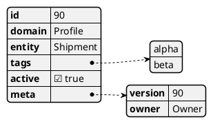

# 090 — Json: Profile

```plantuml
@startjson
{
  "id": 90,
  "domain": "Profile",
  "entity": "Shipment",
  "tags": ["alpha", "beta"],
  "active": true,
  "meta": { "version": 90, "owner": "Owner" }
}
@endjson
```
