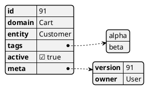

# 091 — Json: Cart

```plantuml
@startjson
{
  "id": 91,
  "domain": "Cart",
  "entity": "Customer",
  "tags": ["alpha", "beta"],
  "active": true,
  "meta": { "version": 91, "owner": "User" }
}
@endjson
```
