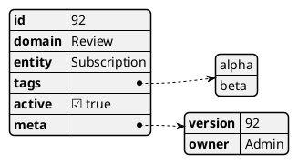

# 092 — Json: Review

```plantuml
@startjson
{
  "id": 92,
  "domain": "Review",
  "entity": "Subscription",
  "tags": ["alpha", "beta"],
  "active": true,
  "meta": { "version": 92, "owner": "Admin" }
}
@endjson
```
