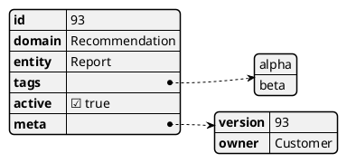

# 093 — Json: Recommendation

```plantuml
@startjson
{
  "id": 93,
  "domain": "Recommendation",
  "entity": "Report",
  "tags": ["alpha", "beta"],
  "active": true,
  "meta": { "version": 93, "owner": "Customer" }
}
@endjson
```
